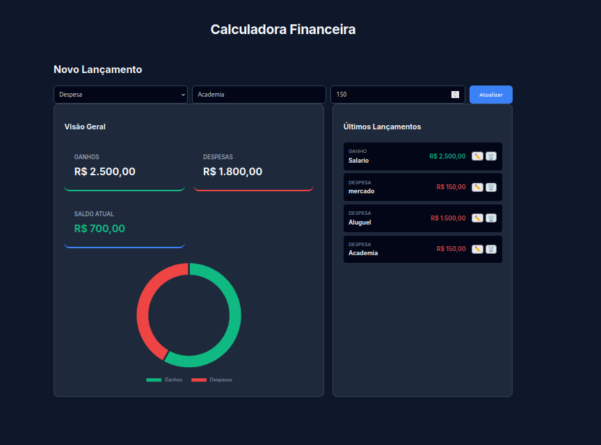

# 💰 Calculadora Financeira

Aplicação web simples para controle financeiro pessoal, desenvolvida com **Python, Flask, HTML, CSS e JavaScript**.

## 📌 Funcionalidades
- Cadastro de **ganhos e despesas**
- Cálculo automático de **saldo**
- **Dashboard interativo** com gráfico (Chart.js)
- Lista de lançamentos com **edição e exclusão**
- Interface moderna em **dark mode**
- Animações suaves e UX aprimorada

## 🛠️ Tecnologias Utilizadas
- Python (Flask)
- HTML5
- CSS3
- JavaScript (ES6+)
- Chart.js
- SQLite

## 🚀 Como executar o projeto

### 1️⃣ Clonar o repositório
```bash
git clone https://github.com/MarcosDev23/Calculadora-Financeira.git
cd Calculadora-Financeira

2️⃣ Criar ambiente virtual
python -m venv venv
source venv/bin/activate  # Linux/Mac
# ou
venv\Scripts\activate     # Windows

3️⃣ Instalar dependências
pip install -r requirements.txt

4️⃣ Executar a aplicação
python app.py


Acesse no navegador:
http://127.0.0.1:5000


